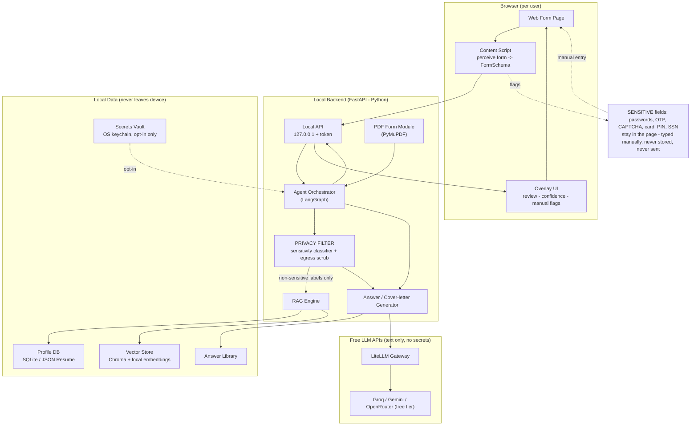

# AutoFill Agent — Architecture & Tech Stack

*A free, local-first, privacy-preserving agentic-RAG form filler you and your friends can run on your own machines. Optimized for job applications (Workday, Greenhouse, Lever, LinkedIn, etc.) but designed to fill **any** form — web or PDF.*

---

## 1. Design principles (the rules everything else follows)

1. **Local-first & free.** Everything runs on the user's own machine. The only thing that leaves the device is text sent to a **free cloud LLM tier** — and each person plugs in their *own* free API key.
2. **Privacy by design (your hard rule).** Secrets — passwords, OTP/2FA codes, CAPTCHA, card number / CVV / PIN, bank logins, SSN/national ID — are **never stored, never embedded, and never sent to the LLM**. They are handled by a *manual-entry passthrough*: the extension flags the field, focuses it, and the user types it directly in the page. The value never touches the backend.
3. **Portable & friend-friendly.** One-command setup. No cloud account to create, no server to host, no paid keys.
4. **Human-in-the-loop.** Nothing auto-submits by default. The user reviews filled values (with confidence colors) and clicks submit.
5. **Provider-agnostic.** The LLM is behind a gateway, so Groq / Gemini / OpenRouter (or a local model later) are swappable via config.

---

## 2. High-level architecture

Three pieces run on the user's machine; only anonymized *text* goes to a free LLM API.

---

## 3. How it fills a form (end-to-end data flow)

1. User opens a form and clicks the extension.
2. **Perceive:** the content script reads the DOM + accessibility tree and builds a normalized `FormSchema` — a list of fields with `{label, type, options, required, selector, sensitivityGuess}`. **No secret values are read.**
3. **Send:** the `FormSchema` (structure only) goes to the local backend over `127.0.0.1` with a local token.
4. **Classify:** the privacy filter tags each field. Sensitive → marked `MANUAL`, skipped entirely. Everything else continues.
5. **Retrieve (RAG):** for each normal field, semantically match the label to a profile value; retrieve supporting context from the résumé/answer library.
6. **Generate:** for open-ended questions ("Why this company?", cover letters), the LLM writes a tailored answer from `{job description on page + profile + answer library}`.
7. **Plan:** backend returns a `FillPlan` = `{selector → value, confidence, source}`; sensitive fields come back as `{selector → MANUAL}`.
8. **Fill & review:** the extension fills fields in-page, highlights low-confidence ones, and flags sensitive fields for the user to type manually.
9. **Submit:** the user reviews and submits (no auto-submit by default).
10. **Learn (optional):** new question→answer pairs are saved to the answer library *after* passing the sensitivity screen, so future forms reuse them.

---

## 4. The tech stack, layer by layer

### 4.1 Browser extension — "eyes & hands" (TypeScript)

| Concern | Recommended | Notes |
|---|---|---|
| Extension platform | **Manifest V3** | Chrome + Edge; Firefox later |
| Framework | **WXT** or **Plasmo** | Modern extension tooling, hot reload |
| UI | **React + Tailwind** | Small popup + in-page overlay |
| Form perception | DOM + ARIA/accessibility tree | Associate labels via `for/id`, `aria-labelledby`, `placeholder` |
| Backend comms | `fetch`/WebSocket to `127.0.0.1` + local token | Keeps everything on-device |
| Filling | Set value + dispatch `input`/`change` events | Works with React/Vue-controlled inputs |

### 4.2 Local backend — "the brain" (Python recommended)

| Concern | Recommended | Java alternative |
|---|---|---|
| Web/API server | **FastAPI** (async) | Spring Boot |
| Agent orchestration | **LangGraph** (stateful, HITL, checkpoints) | LangChain4j |
| LLM abstraction | **LiteLLM** (one API for Groq/Gemini/OpenRouter/local) | LangChain4j model clients |
| Structured output | **Pydantic** + `instructor` | records + JSON schema |

> **On language:** Python is strongly recommended for the core — the agent, RAG, PDF, and embedding ecosystems are far richer. Java (Spring Boot + LangChain4j) is viable for the backend if you're more comfortable there, but you'll fight thinner tooling for vectors/PDF/embeddings. The browser extension is TypeScript either way, so a **Python core + TypeScript extension** is the clean split.

### 4.3 RAG + profile (all local & free)

| Concern | Recommended | Why |
|---|---|---|
| Structured profile | **SQLite** (schema based on **JSON Resume**) | Single portable file, zero setup — perfect for a friend's machine |
| Vector store | **ChromaDB** (embedded) or `sqlite-vec` | No server to run; Chroma is easiest |
| Embeddings | **fastembed** (BAAI `bge-small`) — runs **locally** | Free *and* private: profile text isn't sent to any cloud embedder |
| Document parsing | **PyMuPDF** (PDF), **python-docx** (docx) | Ingest résumé, cover letters, transcripts |
| Reranking (optional) | local cross-encoder | Improve field matching in v2 |

### 4.4 Privacy & secrets layer (your core requirement)

| Concern | Recommended | Behavior |
|---|---|---|
| Never-store list | password, OTP/2FA, CAPTCHA, card no./CVV/PIN, bank login, SSN/ID (configurable) | Detected → `MANUAL`, never stored/sent |
| Sensitivity classifier | Rules (`type=password`, `autocomplete=cc-number`/`one-time-code`, keyword match) + optional LLM check **on the label only, never the value** | Fast + safe |
| Manual-entry passthrough | Extension focuses & highlights the field; user types in-page | Value never leaves the page |
| Egress safety net | Middleware scrubs any LLM-bound payload for secret-like patterns (card regex, etc.) | Defense in depth |
| Opt-in vault (rare) | **keyring** → OS keychain (Windows Credential Manager / macOS Keychain / libsecret) | Encrypted at rest, only if user explicitly saves |
| Profile at rest | **SQLCipher** (encrypted SQLite) or passphrase field-encryption | Protects the profile file |

### 4.5 Agent tools (the actions the agent can take)

`classify_field_sensitivity` · `retrieve_profile_value` · `map_fields` (batch semantic mapping) · `generate_answer` (open-ended). Extension-side executors: `fill`, `select`, `check`, `upload`.

### 4.6 PDF forms (because "any form")

Upload a PDF → detect AcroForm fields (**PyMuPDF / pypdf**) → same agent mapping → return the filled PDF. Scanned PDFs: local OCR with **Tesseract** (free); cloud OCR optional and off by default for privacy.

### 4.7 Free cloud LLM options (your chosen model tier)

All swappable behind **LiteLLM**; each friend uses their own free key:

- **Groq** — very fast, free tier, Llama 3.x / Qwen.
- **Google Gemini** (1.5 Flash) — generous free tier **and vision** (useful for odd/canvas forms).
- **OpenRouter** — several free models.
- **Cerebras** — free tier.

### 4.8 Observability, packaging & licensing

| Concern | Recommended |
|---|---|
| Debugging | **Langfuse** (self-host, free) or structured local logs for MVP |
| Backend packaging | **Docker Compose** one-liner, or PyInstaller single binary / `pipx install` |
| Extension distribution | Load-unpacked for friends, or Chrome Web Store / Firefox Add-ons |
| Config | `.env` per user for their own free API key; setup wizard in popup |
| License | **MIT** or **Apache-2.0** (free & open source) |
| No telemetry | Nothing phones home |

---

## 5. Minimal viable stack (start here)

**Chrome extension (WXT + React)** → **FastAPI backend** → **SQLite profile (JSON Resume)** + **Chroma + fastembed (local)** → **LiteLLM → Groq/Gemini free tier** → rules-based **sensitivity filter** → web-form fill with a **review overlay**. That alone fills real job forms end to end.

## 6. Roadmap

- **MVP:** the stack above (web forms, review-before-submit, manual passthrough for secrets).
- **v2:** PDF forms, answer-library learning, reranking, encrypted profile (SQLCipher), Firefox support, Langfuse.
- **v3:** per-ATS adapters (Workday/Greenhouse/Lever), vision fallback for canvas forms, résumé auto-parse → profile, multi-language.

## 7. Things to keep in mind

- **Terms of Service:** automating some job portals and any CAPTCHA auto-solving can violate their ToS — your "CAPTCHA is manual" rule keeps you on the right side of this.
- **Bot detection:** big ATS platforms detect automation; filling + human submit (not headless auto-submit) is both safer and more reliable.
- **Free-tier limits:** free LLM tiers have rate limits — batch field-mapping into one call per form to stay well under them.

---

### One-line summary

**TypeScript browser extension + Python (FastAPI + LangGraph) local backend + SQLite/Chroma/local-embeddings RAG + LiteLLM to a free cloud LLM — with a hard privacy boundary that keeps passwords, CAPTCHA, and bank details manual-only and off the network.**
